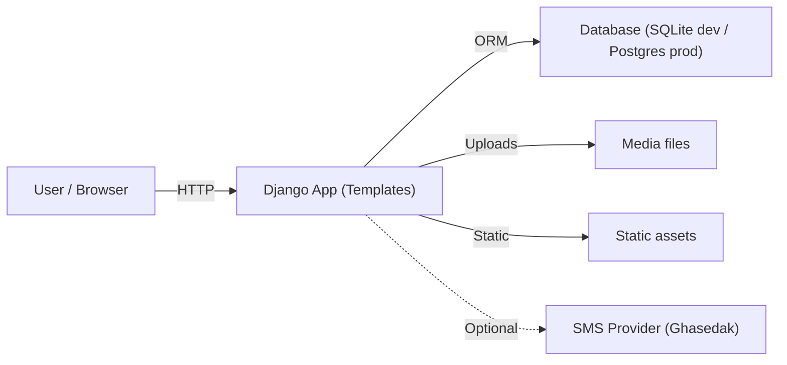

# PetShopRoyal — Django E‑Commerce

A production‑style **Django e‑commerce** application built with server‑rendered templates. It demonstrates real checkout rules (variants, discounts, delivery pricing, coupons), content features (blog), and portfolio‑ready engineering practices (clean setup, env‑based config, tests, CI).

**Live site:** https://petshoproyal.com/

---

## Architecture



---

## Tech Stack

- **Python**, **Django 4**
- Server‑rendered templates (HTML/CSS/JS)
- **SQLite** (default dev) with optional **PostgreSQL** via env vars
- **django-taggit** (tags), **django-filter** (filtering), **sorl-thumbnail** + **django-admin-thumbnails**
- **CKEditor** for rich product/blog content
- **GitHub Actions** CI (Django checks + tests)

---

## Key Features

### Storefront
- Product catalog with **categories + tags**
- **Variants** (size/color) + discount pricing
- Product discovery: filtering, search, pagination
- Availability‑aware sorting (in‑stock first)

### Cart & Checkout
- Cart add/remove/update + item count
- Coupon support
- Delivery pricing logic (weight‑based)

### User & Content
- User accounts + profile details
- Favorites and compare list
- Blog list/detail pages
- Sitemap (`/sitemaps.xml`) for SEO indexing

---

## Quickstart (Local)

### 1) Prerequisites
- Python 3.10+ recommended
- (Optional) PostgreSQL if you want to run with Postgres

### 2) Setup
```bash
# create venv
python -m venv .venv

# activate (Windows)
.\.venv\Scripts\activate

# install deps
pip install -r requirements.txt
```

### 3) Configure environment
Copy the example env file and set values as needed:
```bash
cp .env.example .env
```

Minimum required for local dev:
- `DJANGO_SECRET_KEY` (any random string)
- `DJANGO_DEBUG=True`

### 4) Migrate + run
```bash
python manage.py migrate
python manage.py createsuperuser
python manage.py runserver
```

Open: http://127.0.0.1:8000/

---

## Optional: PostgreSQL

If `POSTGRES_DB` is set, the app uses PostgreSQL; otherwise it falls back to SQLite.

Environment variables:
- `POSTGRES_DB`
- `POSTGRES_USER`
- `POSTGRES_PASSWORD`
- `POSTGRES_HOST`
- `POSTGRES_PORT` (default `5432`)

---

## Admin

After creating a superuser, log in at:
- http://127.0.0.1:8000/admin/

Use Django Admin to manage:
- Categories, products, variants, images
- Coupons, delivery pricing
- Blog posts

---

## Tests

Run tests locally:
```bash
python manage.py test
```

The repo includes **basic smoke tests** for key pages (homepage, product list, sitemap). They are designed to keep CI reliable and can be expanded with deeper business‑rule tests (coupons, delivery pricing, cart totals, etc.).

---

## CI (GitHub Actions)

On every push / PR, CI runs:
- `python manage.py check`
- `python manage.py test`

Workflow file: `.github/workflows/ci.yml`

---

## Repository Structure

```
accounts/        # auth + profile, OTP utilities (optional SMS)
home/            # catalog, product pages, blog, sitemap
cart/            # cart logic and forms
order/           # checkout, coupons, delivery pricing
website/         # Django settings + root urls
templates/       # server-rendered UI
static/          # static assets
```

---

## Security Notes

- **Never commit secrets.** Configuration is designed to come from environment variables (see `.env.example`).
- SMS/OTP integration uses an external provider; set `GHASEDAK_API_KEY` in `.env` **only for local/dev** and store production secrets in your hosting platform’s secret manager.
- If you ever pushed real secrets to a public repo, rotate them immediately.

---

## Roadmap (nice upgrades)

- Add Docker Compose (web + Postgres) for one-command local setup
- Expand tests to cover checkout totals, coupons, delivery pricing, and auth flows
- Add lightweight observability (structured logs)

